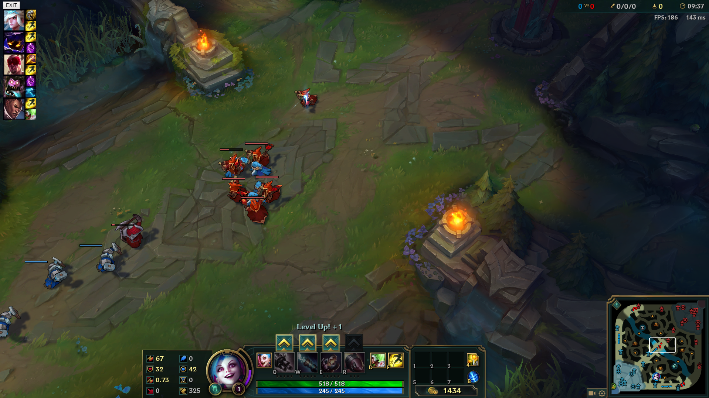
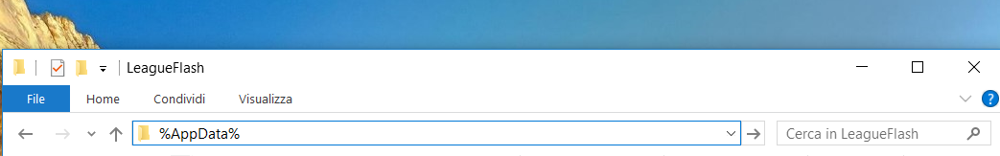
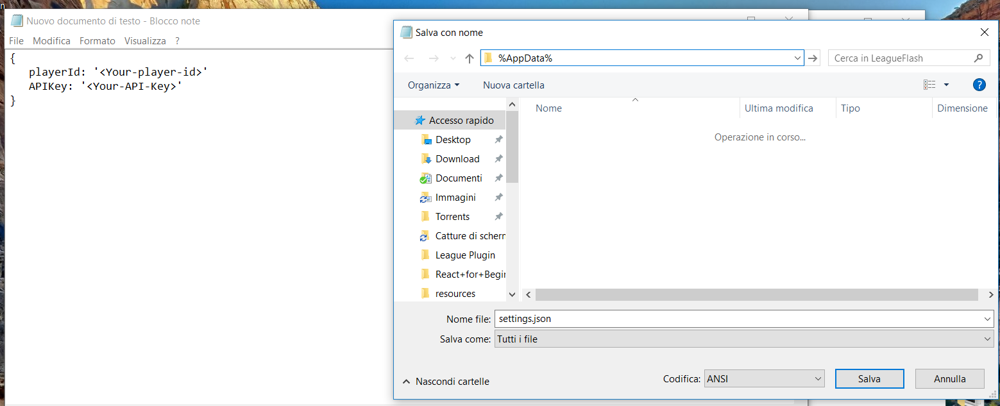
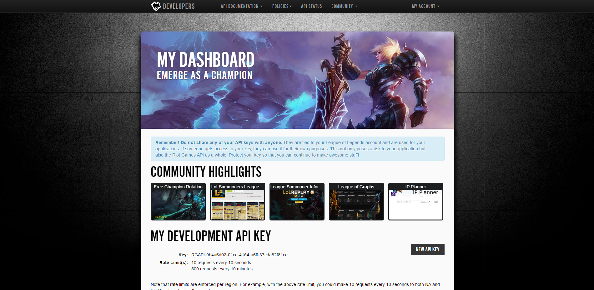

# League Flash

> A Simple League of Legends plugin to keep track of enemies' summoner spells

Just click on a champion's spell to start the timer (It also takes into account the Insight Mastery)

## Screenshot



* **Note: This is not 100% functioning, be careful**
* **While you are ingame your Windows TaskBar will be hidden until you close the application**
* **If you click on the overlay the game will lag a litle bit until you press on the game itsef again**
* **This application only works on Windows 7, 8 or 10 (64bits)**

## Things to do before installing the application

Open Windows Explorer or Cortana and type

```bash
%AppData%
```


Hit enter and create a new folder there called 'LeagueFlash'

Then open NotePad or any other text editor and copy this into it

```bash
{
    "playerID": "<Your-player-id",
    "APIKey": "<Your-Api-Key>"
}
```

Save the file as 'settings.json' and in the folder that you just created
Remember to save it as: Type 'All files'



## Getting the playerId and the APIKey from Riot

Go to the official page of the [Riot API](www.developer.riotgames.com)

Register to the site with your League of Legends account and you'll see a page like this:



Copy the API Key displayed and paste it into the settings.json file that you created replacing:

```bash
<Your-Api-Key>
```

Then go to API DOCUMETATION => FULL API REFERENCE 
Click on 'summoner-v1.4' and click on the first item on the listed

Scroll down until you see 'Path Parameters' and insert your summoner name in the input field

After submitting scroll down until you see 'Response Body'

Here copy the number associated with "id", Here's an example:

```bash
"id": 3389232,
```

Paste the id in the 'settings.json' document replacing <Your-player-id>

## Run

Now you can just [download the App](https://github.com/riccardopiola/LeagueFlash/releases). Make sure to download the latest release, you only need the .exe file.

Double click on the installer to install the application, it will create a shortcut on the Desktop by default

## Disinstall

To disinstall the application you do the same process as any other program:

Control Panel => Remove an application => LeagueFlash
(Those istruction may very depending on the version of the operating system)

You will also have to manually delete the LeagueFlash folder in %AppData%

## Credits

The app was created by riccardopiola using [Electron](https://github.com/electron/electron) and [React](https://facebook.github.io/react/m)

A special thanks goes to the team behind [electron-react-boilerplate](https://github.com/chentsulin/electron-react-boilerplate) for their awesome job in creatig their boilerplate

Riot Games did not endorse this in any way. (They probabily wouldn't be happy about this project)

I do not take any responsability regarnding possibile issues. USE IT AT YOUR OWN RISK

Just so you know: Since it is an application completely separated from League of Legends itself Riot has no way of actually determining whether you are using it or not.
